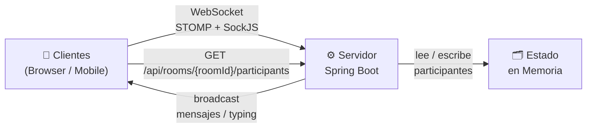
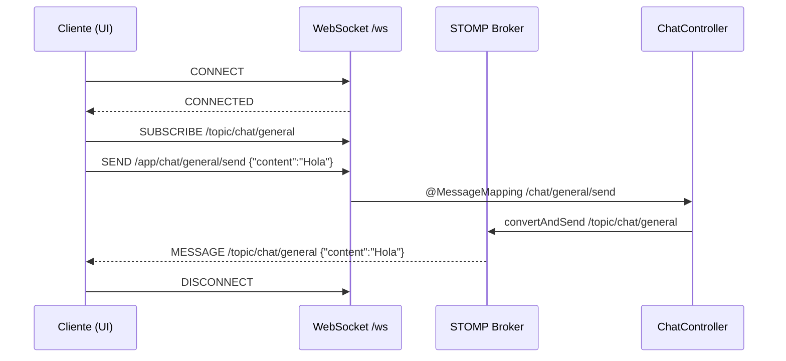

# Backend Chat Room — Documentación API WebSocket

## Arquitectura



---

## Tecnologías

| Componente | Tecnología |
|---|---|
| Framework | Spring Boot 3.5.14 |
| Java | 21 |
| Protocolo | WebSocket + STOMP |
| Fallback | SockJS |
| Docs REST | SpringDoc OpenAPI (Swagger) |

---

## Conexión desde la UI

### Endpoint de conexión WebSocket

```
ws://localhost:8080/ws
```

> Con SockJS (recomendado para compatibilidad de navegadores):
> ```
> http://localhost:8080/ws
> ```

### Ejemplo de conexión con SockJS + STOMP (JavaScript)

```javascript
import SockJS from 'sockjs-client';
import { Client } from '@stomp/stompjs';

const roomId = 'sala-general'; // ID de la sala a la que se une
const username = 'Juan';

const client = new Client({
  webSocketFactory: () => new SockJS('http://localhost:8080/ws'),
  onConnect: () => {
    // 1. Suscribirse a los mensajes de la sala
    client.subscribe(`/topic/chat/${roomId}`, (frame) => {
      const message = JSON.parse(frame.body);
      console.log('Mensaje recibido:', message);
    });

    // 2. Notificar que el usuario entró a la sala
    client.publish({
      destination: `/app/chat/${roomId}/join`,
      body: JSON.stringify({ sender: username, roomId }),
    });
  },
  onDisconnect: () => {
    console.log('Desconectado del servidor');
  },
});

client.activate();
```

---

## Modelo de Mensaje (`ChatMessage`)

Todos los mensajes enviados y recibidos usan la siguiente estructura JSON:

```json
{
  "type": "CHAT",
  "content": "Hola a todos!",
  "sender": "Juan",
  "roomId": "sala-general",
  "timestamp": "2026-04-27T10:30:00"
}
```

### Campos

| Campo | Tipo | Descripción |
|---|---|---|
| `type` | `CHAT` \| `JOIN` \| `LEAVE` \| `TYPING` \| `STOP_TYPING` | Tipo de evento del mensaje |
| `content` | `String` | Texto del mensaje |
| `sender` | `String` | Nombre del usuario que envía |
| `roomId` | `String` | Identificador de la sala |
| `timestamp` | `LocalDateTime` | Fecha y hora del mensaje (asignado por el servidor) |

---

## Acciones disponibles (destinos STOMP)

### 1. Enviar un mensaje de chat

- **Destino (cliente → servidor):** `/app/chat/{roomId}/send`
- **Broadcast (servidor → clientes):** `/topic/chat/{roomId}`

```javascript
client.publish({
  destination: `/app/chat/${roomId}/send`,
  body: JSON.stringify({
    type: 'CHAT',
    content: 'Hola a todos!',
    sender: username,
  }),
});
```

---

### 2. Unirse a una sala

- **Destino (cliente → servidor):** `/app/chat/{roomId}/join`
- **Broadcast (servidor → clientes):** `/topic/chat/{roomId}`

El servidor guardará el `username` y el `roomId` en la sesión WebSocket para manejar desconexiones automáticamente.

```javascript
client.publish({
  destination: `/app/chat/${roomId}/join`,
  body: JSON.stringify({
    sender: username,
    roomId,
  }),
});
```

**Mensaje broadcast generado:**
```json
{
  "type": "JOIN",
  "content": "Juan joined the room",
  "sender": "Juan",
  "roomId": "sala-general",
  "timestamp": "2026-04-27T10:30:00"
}
```

---

### 3. Salir de una sala (explícito)

- **Destino (cliente → servidor):** `/app/chat/{roomId}/leave`
- **Broadcast (servidor → clientes):** `/topic/chat/{roomId}`

```javascript
client.publish({
  destination: `/app/chat/${roomId}/leave`,
  body: JSON.stringify({
    sender: username,
    roomId,
  }),
});
```

**Mensaje broadcast generado:**
```json
{
  "type": "LEAVE",
  "content": "Juan left the room",
  "sender": "Juan",
  "roomId": "sala-general",
  "timestamp": "2026-04-27T10:30:00"
}
```

---

### 4. Indicador de escritura (*typing indicator*)

- **Destino (cliente → servidor):** `/app/chat/{roomId}/typing`
- **Broadcast (servidor → clientes):** `/topic/chat/{roomId}/typing`

El canal de typing es **independiente** del canal de mensajes para que la UI pueda manejarlo por separado.

**Suscripción en la UI:**
```javascript
client.subscribe(`/topic/chat/${roomId}/typing`, (frame) => {
  const msg = JSON.parse(frame.body);
  if (msg.type === 'TYPING') {
    showTypingIndicator(msg.sender); // ej: "Juan está escribiendo..."
  } else {
    hideTypingIndicator(msg.sender);
  }
});
```

**Enviar eventos (con debounce recomendado):**
```javascript
let typingTimeout;

inputEl.addEventListener('input', () => {
  client.publish({
    destination: `/app/chat/${roomId}/typing`,
    body: JSON.stringify({ type: 'TYPING', sender: username }),
  });

  clearTimeout(typingTimeout);
  typingTimeout = setTimeout(() => {
    client.publish({
      destination: `/app/chat/${roomId}/typing`,
      body: JSON.stringify({ type: 'STOP_TYPING', sender: username }),
    });
  }, 2000);
});
```

**Mensajes broadcast generados:**
```json
{ "type": "TYPING",      "content": "Juan is typing...", "sender": "Juan", "roomId": "sala-general" }
{ "type": "STOP_TYPING", "content": "",                  "sender": "Juan", "roomId": "sala-general" }
```

---

### 5. Desconexión abrupta (cierre de pestaña / pérdida de red)

No requiere acción del cliente. El servidor detecta la desconexión via `SessionDisconnectEvent` y emite automáticamente un mensaje `LEAVE` a la sala correspondiente.

---

## Endpoint REST

### Listar participantes activos de una sala

```
GET http://localhost:8080/api/rooms/{roomId}/participants
```

**Respuesta:**
```json
["Juan", "Maria", "Carlos"]
```

> Los participantes se registran al hacer `/join` y se eliminan al hacer `/leave` o al desconectarse abruptamente.

---

## Flujo completo de una sesión

```
UI                                         Servidor
 |                                              |
 |-- SockJS connect /ws ----------------------->|
 |<-- Conexión establecida --------------------|
 |                                              |
 |-- /app/chat/{roomId}/join ---------------->  |
 |<-- /topic/chat/{roomId} [JOIN] -------------|  (broadcast a todos)
 |                                              |
 |-- /app/chat/{roomId}/typing [TYPING] ------> |
 |<-- /topic/chat/{roomId}/typing [TYPING] ----|  (broadcast a todos)
 |                                              |
 |-- /app/chat/{roomId}/typing [STOP_TYPING] -> |
 |<-- /topic/chat/{roomId}/typing [STOP_TYPING]|  (broadcast a todos)
 |                                              |
 |-- /app/chat/{roomId}/send ----------------> |
 |<-- /topic/chat/{roomId} [CHAT] -------------|  (broadcast a todos)
 |                                              |
 |-- /app/chat/{roomId}/leave ---------------> |
 |<-- /topic/chat/{roomId} [LEAVE] ------------|  (broadcast a todos)
 |                                              |
 |-- [cierre de conexión] --------------------> |
 |<-- /topic/chat/{roomId} [LEAVE] ------------|  (auto, WebSocketEventListener)
```

---

## ¿Cómo funciona STOMP?

**STOMP** (Simple Text Oriented Messaging Protocol) es un protocolo de mensajería que corre sobre WebSocket. Mientras WebSocket solo abre un canal de comunicación bidireccional, STOMP define un formato y unas reglas para el envío de mensajes, similar a cómo HTTP define cómo hacer peticiones web.

### WebSocket vs STOMP

| | WebSocket | STOMP sobre WebSocket |
|---|---|---|
| Qué es | Canal de comunicación | Protocolo de mensajería |
| Formato | Bytes / texto libre | Frames con cabeceras y cuerpo |
| Suscripciones | No nativas | Sí, con `SUBSCRIBE` a destinos |
| Broadcast | Manual | Gestionado por el broker |

### Ciclo de vida de un mensaje STOMP



### Tipos de frame STOMP

| Frame | Dirección | Descripción |
|---|---|---|
| `CONNECT` | Cliente → Servidor | Inicia la sesión STOMP |
| `CONNECTED` | Servidor → Cliente | Confirma la sesión |
| `SUBSCRIBE` | Cliente → Servidor | Se suscribe a un destino (`/topic/...`) |
| `SEND` | Cliente → Servidor | Envía un mensaje a un destino (`/app/...`) |
| `MESSAGE` | Servidor → Cliente | Entrega un mensaje al suscriptor |
| `DISCONNECT` | Cliente → Servidor | Cierra la sesión |

### Por qué SockJS

Los WebSockets puros pueden ser bloqueados por proxies o firewalls corporativos. **SockJS** actúa como wrapper: intenta usar WebSocket nativo primero y si falla, cae automáticamente a alternativas como HTTP long-polling. Por eso la conexión se hace a `http://localhost:8080/ws` en lugar de `ws://`.

---

## Prefijos STOMP configurados

| Prefijo | Uso |
|---|---|
| `/app` | Mensajes enrutados al servidor (`@MessageMapping`) |
| `/topic` | Canal de broadcast (broker en memoria) |
| `/queue` | Canal privado/unicast (broker en memoria) |

---

## Dependencias necesarias en la UI

### npm (React / Vue / Angular)

```bash
npm install sockjs-client @stomp/stompjs
```

### CDN

```html
<script src="https://cdn.jsdelivr.net/npm/sockjs-client/dist/sockjs.min.js"></script>
<script src="https://cdn.jsdelivr.net/npm/@stomp/stompjs/bundles/stomp.umd.min.js"></script>
```

---

## Swagger / OpenAPI

Documentación REST disponible en:

```
http://localhost:8080/swagger-ui/index.html
```
