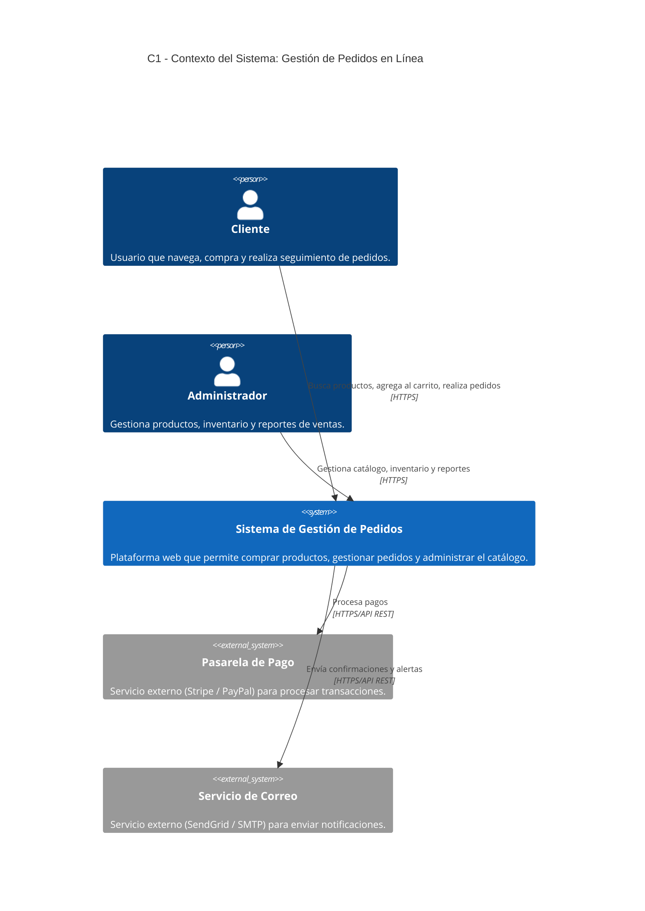
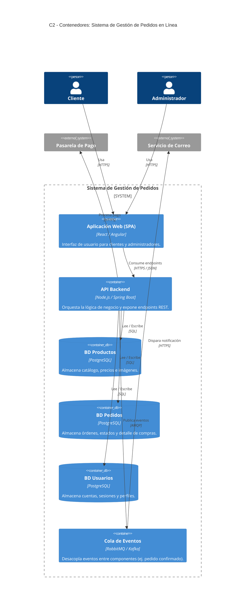
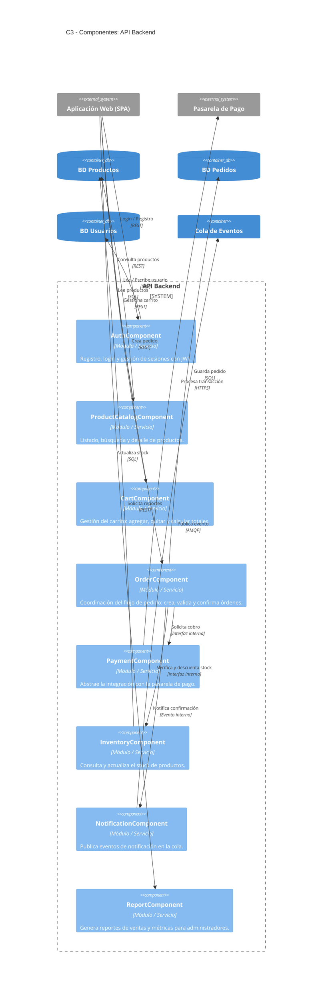

# Arquitectura Orientada a Componentes — Sistema de Gestión de Pedidos en Línea

---

## C1 — Diagrama de Contexto del Sistema

Muestra el sistema en su entorno: quiénes lo usan y con qué sistemas externos se integra.

---

## C2 — Diagrama de Contenedores

Muestra las aplicaciones y bases de datos que componen el sistema y cómo se comunican.

---

## C3 — Diagrama de Componentes (API Backend)

Muestra los componentes internos del contenedor **API Backend** y sus responsabilidades.

---

## Resumen de Componentes

| Componente | Responsabilidad | Dependencias |
|---|---|---|
| `AuthComponent` | Autenticación y sesiones (JWT) | BD Usuarios |
| `ProductCatalogComponent` | Catálogo y búsqueda | BD Productos |
| `CartComponent` | Carrito de compras | ProductCatalogComponent |
| `OrderComponent` | Flujo y coordinación del pedido | PaymentComponent, InventoryComponent, NotificationComponent |
| `PaymentComponent` | Integración con pasarela externa | Pasarela de Pago |
| `InventoryComponent` | Control de stock | BD Productos |
| `NotificationComponent` | Publicación de eventos de alerta | Cola de Eventos |
| `ReportComponent` | Reportes y métricas | BD Pedidos, BD Productos |
