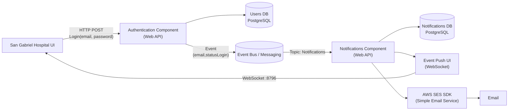

# Arquitectura2026-1
Este repositorio esta enfocado a tener todo el código hecho para la asignatura de Arquitectura 2026. Servira como base para la asignatura durante los próximos semestres.

## 1. Primer Ejemplo: San Gabriel Hospital – Authentication & Notifications Architecture

Este proyecto presenta una **arquitectura basada en microservicios y eventos** para gestionar el proceso de **autenticación de usuarios y generación de notificaciones** en el sistema del **Hospital San Gabriel**.

La arquitectura permite desacoplar los componentes del sistema mediante el uso de **eventos y mensajería**, facilitando la escalabilidad, el mantenimiento y la evolución del sistema.

El flujo principal inicia cuando un usuario intenta autenticarse en la plataforma. Si la autenticación es exitosa, se genera un evento que posteriormente es procesado por el sistema de notificaciones, el cual puede enviar mensajes en tiempo real al cliente o correos electrónicos.

## Arquitectura San Gabriel

