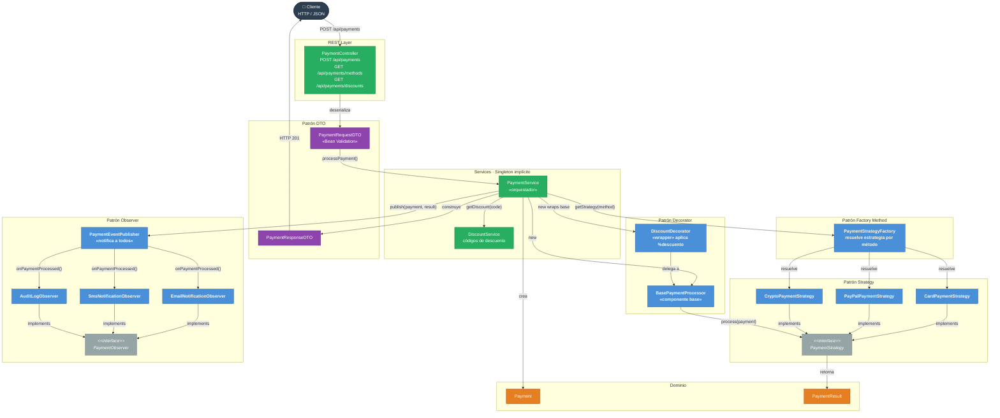

# Patrones de Diseño

## Enunciado de Patrones de Diseño
Desarrollo de un microservicio de procesamiento de pagos dinámicos con soporte para múltiples pasarelas (Tarjeta, PayPal, Cripto), sistema de descuentos por capas y notificaciones automáticas, basado en patrones de diseño de la Industria.

### Patrones de Diseño a implementar
Identificación de patrones potenciales aplicar en esta WebApi

* Strategy: Para realizar el pago con diferentes tipos de tarjetas.
* Factory Method: La creación de la instanacia a ejectura para el Strategy
* Observer: Se debe implementar para recibir la notificación de que el pago se realizo y luego enviar las notificaciones necesarias.
* Decorator: Añade descuentos dinamicos sin modificar la estrategia de pagos.
* State: Patron basado en estados para el procesamiento de los pagos.

### Patrones de diseño que vienen con Springboot:
Springboot trae implementados algunos patrones por defecto, estos no los modificaremos para nuestro ejercicio

* Singleton: Gestionar las instancias que requerimos inyectar en la aplicación.
* DTO: Aíslar la capa HTTP del modelo de Dominio.

---

## Patrones aplicados

| Patrón | Dónde | Propósito |
|--------|-------|-----------|
| **Strategy** | `strategy/` | Encapsula cada método de pago (Card, PayPal, Crypto) como algoritmo intercambiable |
| **Factory Method** | `PaymentStrategyFactory` | Resuelve y crea la estrategia correcta según el método indicado |
| **Singleton** | Todos los `@Component` / `@Service` | Spring gestiona una única instancia por bean |
| **Decorator** | `decorator/` | Añade descuentos dinámicos sin modificar la estrategia base |
| **Observer** | `observer/` | Notifica por Email, SMS y Auditoría tras procesar el pago |
| **DTO** | `dto/` | Aísla la capa HTTP del modelo de dominio |

---

## Diagrama de Componentes (C4 — Nivel 3)


---

## Flujo principal

```
Cliente
  │  POST /api/payments  { amount, method, currency, discountCode }
  ▼
PaymentController
  │  PaymentRequestDTO  (Bean Validation)
  ▼
PaymentService
  ├─► DiscountService.getDiscount(code)
  ├─► [Factory]   PaymentStrategyFactory  →  Card | PayPal | Crypto
  ├─► [Decorator] BasePaymentProcessor
  │               └── DiscountDecorator (si aplica código)
  ├─► [Observer]  PaymentEventPublisher
  │               ├── EmailNotificationObserver
  │               ├── SmsNotificationObserver
  │               └── AuditLogObserver
  └─► PaymentResponseDTO
  ▼
Cliente  { paymentId, originalAmount, finalAmount, discountPercentage, status, txId }
```

---

## Endpoints

| Método | URL | Descripción |
|--------|-----|-------------|
| `POST` | `/api/payments` | Crear y procesar un pago |
| `GET` | `/api/payments/methods` | Métodos de pago soportados |
| `GET` | `/api/payments/discounts` | Códigos de descuento disponibles |

---